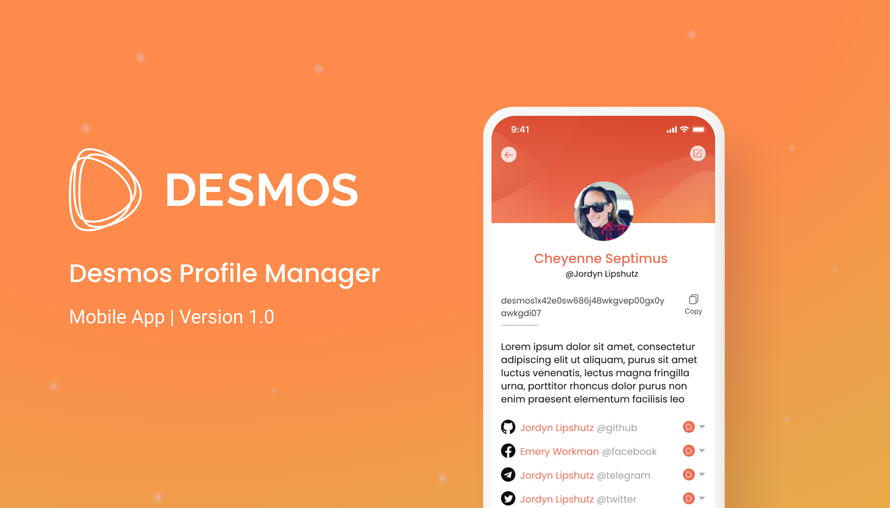

[](https://dpm.desmos.network/)

# Desmos Profile Manager

Repository of the Desmos Profile Manager mobile application

## Development

If you would like to develop new features of this application, you can do so by following the steps below.

### Prerequisites

1. Download and install Node LTS [16.15.X](https://nodejs.org/it/download/)
2. Install [Yarn](https://classic.yarnpkg.com/lang/en/docs/install/)

### Setup

To be able to run the code, you will need to perform some setup steps.

#### Google Play Services

To properly run the application, you will need a `google-service.json` file. This is going to be used in order to
properly use the Firebase SDK to receive notifications.

Once you have that file, you will need to place it inside the `android/app` folder.

#### Branch.io

In order to properly use the Branch.io SDK, you will need to create a `branch_keys.xml` file inside the
`android/app/src/main/res/values` folder. This file should contain the following content:

```xml

<resources>
    <string name="branch_key">{YOUR_LIVE_BRANCH_KEY}</string>
    <string name="branch_key_test">{YOUR_TEST_BRANCH_KEY}</string>
</resources>
```

### Android

To run the Android version of the application, just run the following command:

```
yarn run android
```

### iOS

To run the iOS version of the application, run the following commands:

```
cd ios && pod install
yarn run ios
```

## Social networks

- [Take a look at the website](https://dpm.desmos.network/)
- [Follow us on X (Twitter)](https://twitter.com/desmosnetwork)
- [Read about us on Medium](https://medium.com/desmosnetwork)
